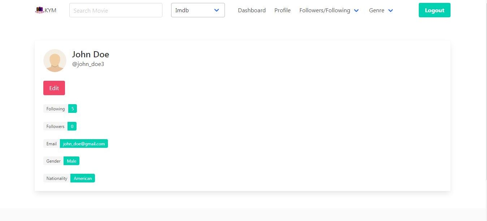

# Moviez

Moviez is a simple webapp focused on recommending movies to users based on simple rules.

# Installation and Running

1. You can use docker compose in order to quickly get the services up and running using the command:
      ```bash
      docker compose up
      ```
   > Note: The environment variables specified in `./env-sample.sh` needs to be sourced or added in a `.env` file before running the docker compose command.

2. If you are not comfortable using docker compose, you would need to create a virtualenv for installing the dependencies for the webapp and setup databases (along with phpmyadmin, if you want to view the db graphically) yourself. Thus, it is recommended to use docker compose.

# Screenshots

 
 

