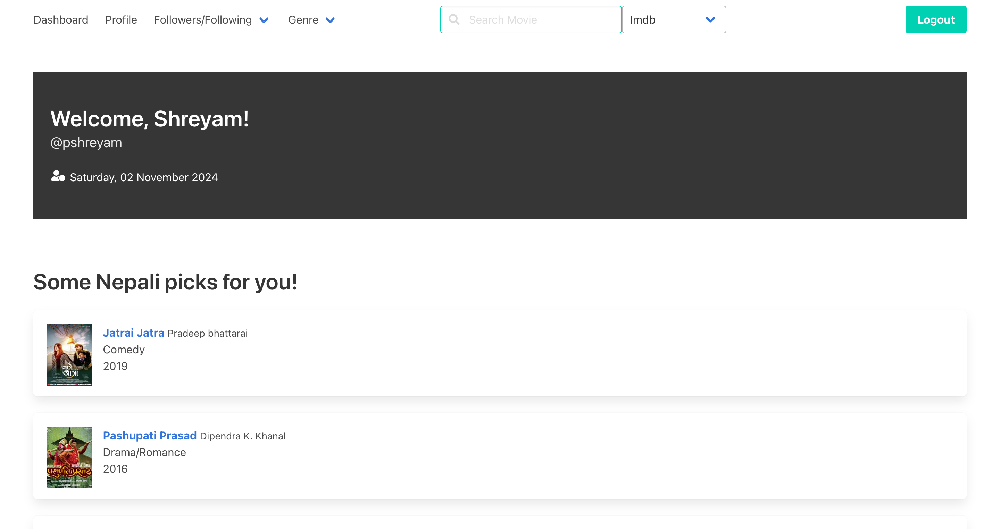
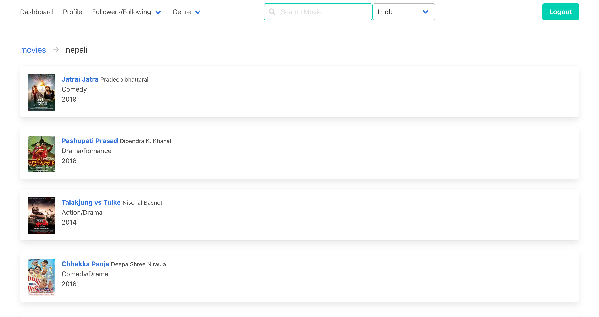
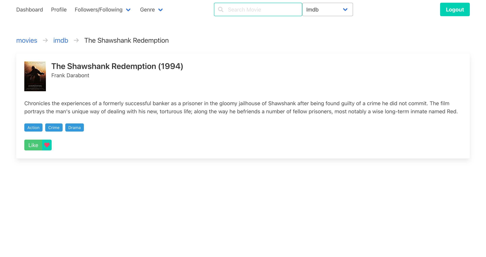
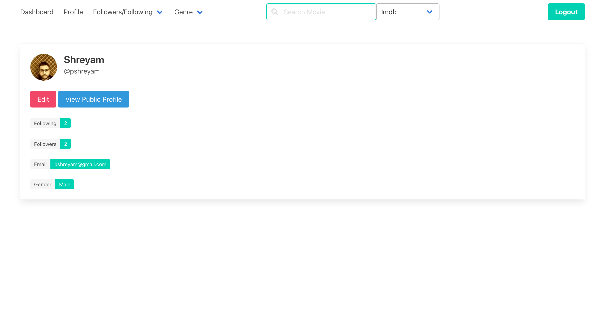

# Moviez

Moviez is a simple platform focused on recommending movies in the database to users based on basic rules.

> Note: The main branch contains code with cleaner history (heavily rebased for future maintainance and learning rebase operations 😅). For the older code (with messier history), please check `old-code-with-messy-history` branch.

# Getting Started

Use docker compose in order to quickly set up the web app locally and start using it.

```bash
docker compose up
```

> Note: Define the environment variables in a `.env` file with the help of `.env.example` before running the command above.

# Screenshots

 
 

